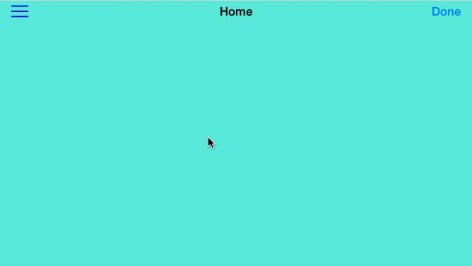

# Hamburger Menu

`HMMenuViewController` is a fun, interactive, easy-to-use, customizable slide menu. As easy as instantiate, set images and titles, set delegate, call show method and ENJOY!!!

### Features

* Partial or full screen menu
* Translucent (blur effect) background
* Enable/disable scale background effect 
* Enable/disable slide animation
* Enable/disable cell animation
* Enable/disable tap animation
* Enable/disable closing menu after rotating device
* Hiding close button when scrolling tableview up

### Screenshoots




### Usage

##### Instantiate HMMenuViewController NOT using Storyboard. 

In this case `HMMenuViewController` will handle the subview frames inside the viewcontroller. Subview frames will be updated when rotating device. Just instantiate using custom initializer:

```swift
let menuViewController = HMMenuViewController(images:manager.images!, titles:manager.titles!, closeImageButton:manager.closeMenuButtonImage!)
```

##### Instantiate HMMenuViewController using Storyboard

In this case just make sure to connect `@IBOutlet` before instantiating, and use AutoLayout:

```swift
@IBOutlet var tableView: UITableView!
@IBOutlet var closeButton: UIButton!
@IBOutlet var containerView: UIView! // contains tableView and closeButton, added as a subView of self.view
@IBOutlet weak var containerViewWidthConstraint: NSLayoutConstraint! // used to animate containerView sliding
@IBOutlet weak var buttonOriginYConstraint: NSLayoutConstraint! // used to animate hiding closeButton when scrolling tableView up
@IBOutlet var blurEffectView: UIVisualEffectView! //used to add background blur effect
```

Instantiate `HMMenuViewController` as follow:

```swift
let menuViewController = UIStoryboard(name:"Main", bundle: nil).instantiateViewControllerWithIdentifier("MenuController") as! HMMenuViewController
menuViewController.images = manager.images
menuViewController.titles = manager.titles
menuViewController.closeImageButton = manager.closeMenuButtonImage
```

##### HMMenuViewControllerDelegate

The `UIViewController` showing `HMMenuViewController` instance MUST conform to protocol `HMMenuViewControllerDelegate` and implement required method:

```swift
// required protocol method
// This method will tell the delegate when an item from the menu is selected.
func menuViewController (menuViewController:HMMenuViewController, didSelectItemAtIndexPath indexPath:NSIndexPath) {
    if indexPath.row < HMViewControllerManager.sharedInstance.viewControllers?.count {
        if let viewController = HMViewControllerManager.sharedInstance.viewControllers?.objectAtIndex(indexPath.row) as? UIViewController {
            navigationController?.viewControllers = [viewController]
        }
    }
}
```

##### Showing HMMenuViewController

The `UIViewController` showing `HMMenuViewController` instance MUST be embedded in a `UINavigationController`

```swift
navigationItem.leftBarButtonItem = UIBarButtonItem(image:hamburgerMenuButtonImage, style:.Plain, target:self, action:"showMenuViewController")
```

To show `HMMenuViewController` instance set delegate and call `showMenuFromController(:)` method

```swift
func showMenuViewController () {
    menuController.delegate = self
    menuController.showMenuFromController(self)
}
```

### Version

1.0.0

### License

`HamburgerMenu` is released under the MIT license.

### Author

Francisco Bernal Yescas ([@fbernaly](http://twitter.com/fbernaly))
